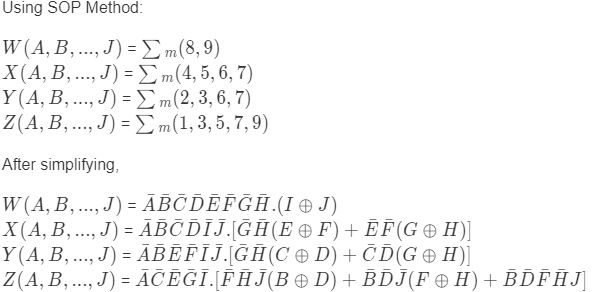

Final Simulation Link: https://circuitverse.org/users/15874/projects/47316

### Question
Design a circuit (Boolean Expression) w/ logic gate that can convert a decimal number to binary

### Visual Representation of the question

Let's assume there is a numpad of the following sort

when you press one of those numbers, you should get the binary represantation of that number as output. For that we need to figure out how to ouput the represantation.

The binary represantation of the numbers 0-9 follow:

The table shows that we need at least a 4-bit space to write 0 through 9

So, we can put 4 LEDs side-by-side representing each bit

Let's assume the LED is yellow when turned off and red when it is turned on

When 6 is pressed the state of the LEDs will be:

So the LED turns on when we send a **1** and turns off when given a signal **0**

### Inputs and Outputs
Each of the number is represented by a switch that has two states - on(1)/off(0) marked A-J

The output is a set of 4 LEDs representing each bit of the binary number where a turned on LED means 1 and a turned off LED means 0.

Inititally, all of them are turned off.

### Table
We can generate a truth table consisting each case where one(and only one) switch is pressed.

### Equations
To represent the state (0/1) of each LED, we can use a boolean equation

### The circuit
We get the following circuit after implementing the equations

which works as following

If we interpret a turned on LED as **1** and a turned off LED as **0**, the set of LEDs give the correct binary representation of the pressed switch/number